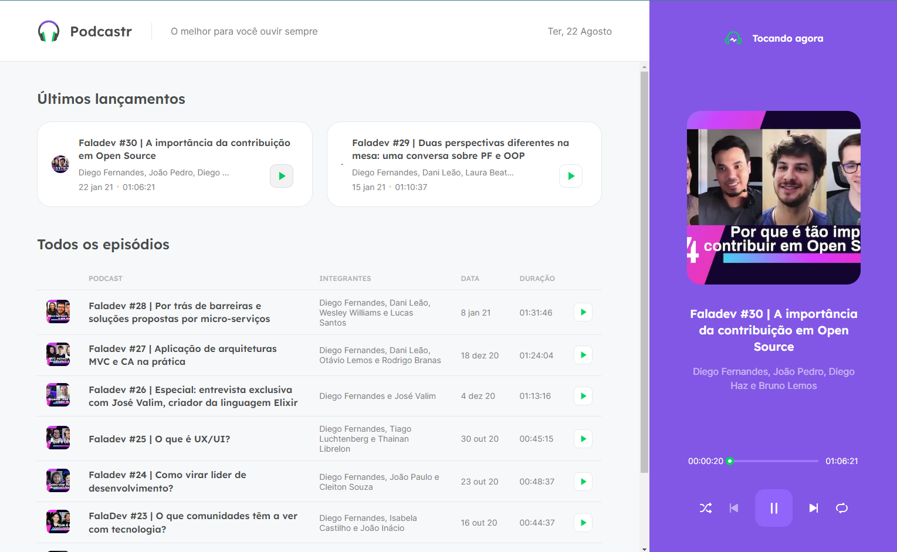
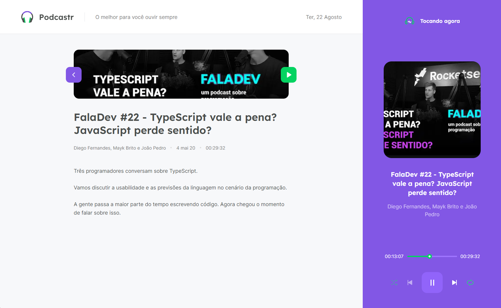

# Podcastr | Next Level Week #05

Projeto desenvolvido durante a Next Level Week 5, evento organizado pela [Rocketseat](https://www.rocketseat.com.br/). O Podcastr é um app de podcasts com a proposta de discutir temas voltados a técnologias de desenvolvimento web. 

 

## :art: Figma
Acesse o layout do projeto [aqui](https://www.figma.com/file/Gk90RPWwW2mFnhCLUFmnrX/Podcastr?type=design&mode=design&t=LzvWQ6O7hjP9K3ju-1)

## :rocket: Tecnologias
* Next.js
* React
* Typescript
* Sass
* Axios

## :computer: Como executar o projeto na sua máquina

1. Certifique-se de ter o Node.js instalado em sua máquina.
2. Clone este repositório para o seu computador.
3. Na pasta do projeto, abra o terminal e execute o comando `yarn install` para instalar as dependências.
4. Execute o comando `yarn server` para iniciar o servidor do Back-End.
5. Em seguida, execute o comando `yarn dev` para iniciar o servidor de desenvolvimento.
6. O aplicativo será aberto automaticamente no seu navegador. Se não abrir, acesse o endereço especificado no terminal.
